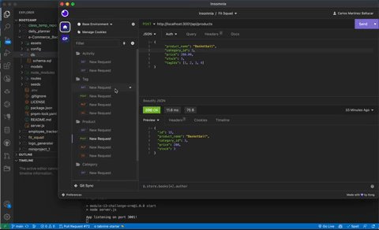

[](https://opensource.org/licenses/MIT)
# 🛒💰 E-Commerce Back End
## 🌟 Description
This project aims to build a back end for an e-commerce site. It uses the latest technologies, including Node.js, Express.js, Sequelize, and MySQL to provide a robust API for front-end applications. The API allows for CRUD operations on various e-commerce entities like products, categories, and tags.
## 📜 User Story
```
AS A manager at an internet retail company
I WANT a back end for my e-commerce website that uses the latest technologies
SO THAT my company can compete with other e-commerce companies
```
## 🚀 Installation
1. Clone this GitHub repository
```bash
git clone git@github.com:carlosmb001/e-Commerce_Back_End_ORM.git
```
2. Install the required npm packages
```bash
npm install
```
3. Create a `.env` file to store your MySQL credentials
```bash
DB_NAME='ecommerce_db'
DB_USER='your_mysql_username'
DB_PW='your_mysql_password'
```
4. Create the database using MySQL commands
```bash
source db/schema.sql
```
5. Seed the database
```bash
npm run seed
```
## ▶️ Usage
1. To start the server, run the following command
```bash
npm start
```
2. Install [Insomnia](https://insomnia.rest/download) to test out the routes.
## Walkthrough Video
<a href="https://www.youtube.com/watch?v=9cK9NkPGEbs"></a>

## 💻 Technologies Used
- Node.js
- Express.js
- MySQL
- Sequelize
- Dotenv

## 🔗 API Routes
### Category Routes
- `GET /api/categories`: Get all categories
- `GET /api/categories/:id`: Get a single category by its `id`
- `POST /api/categories`: Create a new category
- `PUT /api/categories/:id`: Update a category by its `id`
- `DELETE /api/categories/:id`: Delete a category by its `id`

### Product Routes
- `GET /api/products`: Get all products
- `GET /api/products/:id`: Get a single product by its `id`
- `POST /api/products`: Create a new product
- `PUT /api/products/:id`: Update a product by its `id`
- `DELETE /api/products/:id`: Delete a product by its `id`

### Tag Routes
- `GET /api/tags`: Get all tags
- `GET /api/tags/:id`: Get a single tag by its `id`
- `POST /api/tags`: Create a new tag
- `PUT /api/tags/:id`: Update a tag by its `id`
- `DELETE /api/tags/:id`: Delete a tag by its `id`

### 🔗 Example API Call 
To get all categories:
```bash
GET "http://localhost:3001/api/categories/"
```
To get all Product:
```bash
GET "http://localhost:3001/api/products"
```
To get all Tag:
```bash
GET "http://localhost:3001/api/tags"
```
## 📄 License
This project uses the MIT license.
## 👏 Acknowledgements
edX Boot Camps LLC for the project prompt and resources.


